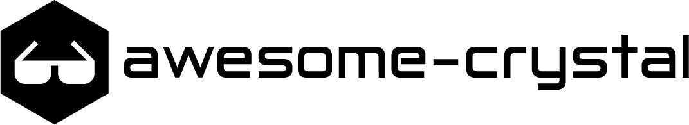

# Awesome Crystal

A curated list of awesome Crystal code and resources. Inspired by [awesome](https://github.com/sindresorhus/awesome) and [awesome-awesomeness](https://github.com/bayandin/awesome-awesomeness).
The goal is to have projects mostly stable and useful for the community.

Search shards at [shards.info](https://shards.info) for more.

Contributions are welcome. Please take a quick look at the [contribution guidelines](https://github.com/veelenga/awesome-crystal/blob/master/.github/CONTRIBUTING.md) first.

* [Awesome Crystal](#awesome-crystal)
  * [Algorithms and Data structures](#algorithms-and-data-structures)
  * [Blockchain](#blockchain)
  * [C Bindings](#c-bindings)
  * [Caching](#caching)
  * [CLI Builders](#cli-builders)
  * [CLI Utils](#cli-utils)
  * [Code Analysis and Metrics](#code-analysis-and-metrics)
  * [Compression](#compression)
  * [Configuration](#configuration)
  * [Converters](#converters)
  * [Cryptography](#cryptography)
  * [Data Formats](#data-formats)
  * [Data Generators](#data-generators)
  * [Database Drivers/Clients](#database-driversclients)
  * [Database Tools](#database-tools)
  * [Debugging](#debugging)
  * [Dependency Injection](#dependency-injection)
  * [Email](#email)
  * [Environment Management](#environment-management)
  * [Examples and funny stuff](#examples-and-funny-stuff)
  * [Framework Components](#framework-components)
  * [Game Development](#game-development)
  * [GUI Development](#gui-development)
  * [HTML Builders](#html-builders)
  * [HTML/XML parsing](#htmlxml-parsing)
  * [HTTP](#http)
  * [Image Processing](#image-processing)
  * [Implementations/Compilers](#implementationscompilers)
  * [Internationalization](#internationalization)
  * [Logging and monitoring](#logging-and-monitoring)
  * [Machine Learning](#machine-learning)
  * [Markdown/Text Processors](#markdowntext-processors)
  * [Misc](#misc)
  * [Network Protocols](#network-protocols)
  * [Networking](#networking)
  * [ORM/ODM Extensions](#ormodm-extensions)
  * [Package Management](#package-management)
  * [Processes and Threads](#processes-and-threads)
  * [Project Generators](#project-generators)
  * [Queues and Messaging](#queues-and-messaging)
  * [Routing](#routing)
  * [Scheduling](#scheduling)
  * [Science and Data analysis](#science-and-data-analysis)
  * [Search](#search)
  * [Serverless Computing](#serverless-computing)
  * [System](#system)
  * [Task management](#task-management)
  * [Template Engine](#template-engine)
  * [Testing](#testing)
  * [Third-party APIs](#third-party-apis)
  * [Validation](#validation)
  * [Web Frameworks](#web-frameworks)
* [Community](#community)
  * [Unofficial](#unofficial)
* [Resources](#resources)
  * [Official Documentation Translations](#official-documentation-translations)
* [Services and Apps](#services-and-apps)
* [Tools](#tools)
  * [DevOps](#devops)
  * [Editor Plugins](#editor-plugins)
  * [LSP Language Server Protocol Implementations](#lsp-language-server-protocol-implementations)
  * [Shell Plugins](#shell-plugins)

## Algorithms and Data structures
 * [bisect](https://github.com/spider-gazelle/bisect) - Inserting values into a sorted array
 * [blurhash.cr](https://github.com/Sija/blurhash.cr) - [BlurHash](https://github.com/woltapp/blurhash) implementation
 * [crie](https://github.com/c910335/crie) - Compile-time Trie
 * [CrOTP](https://github.com/philnash/crotp) - HOTP and TOTP implementation for two factor authentication
 * [crystal-linked-list](https://github.com/abvdasker/crystal-linked-list) - Implementation of Linked List
 * [crystaledge](https://github.com/unn4m3d/crystaledge) - A pure Vector Math library
 * [crystalg](https://github.com/tobyapi/crystalg) - A Generic Algorithm Library
 * [crystalline](https://github.com/jtomschroeder/crystalline) - A collection of containers and algorithms
 * [csuuid](https://github.com/wyhaines/csuuid.cr) - A Chronologically Sortable UUID
 * [edits.cr](https://github.com/tcrouch/edits.cr) - Collection of edit distance algorithms
 * [fzy](https://github.com/hugopl/fzy) - A Crystal port of awesome Fzy project fuzzy finder algorithm
 * [Goban](https://github.com/soya-daizu/goban) - A fast and efficient QR Code implementation
 * [graphlb](https://github.com/mettuaditya/graphlb) - Collection of graph datastructure and algorithms
 * [haversine](https://github.com/geocrystal/haversine) - An Implementation of the Haversine formula
 * [HKDF](https://github.com/spider-gazelle/HKDF) - HMAC-based Extract-and-Expand Key Derivation Function [rfc5869](https://www.rfc-editor.org/rfc/rfc5869)
 * [kd_tree](https://github.com/geocrystal/kd_tree) - An implementation of "K-Dimensional Tree" and "N-Nearest Neighbors"
 * [ksuid.cr](https://github.com/Sija/ksuid.cr) - K-Sortable Globally Unique IDs
 * [markov](https://github.com/mccallofthewild/markov) - Build Markov Chains and run Markov Processes
 * [multiset.cr](https://github.com/tcrouch/multiset.cr) - Implementation of a multiset
 * [named_information](https://github.com/spider-gazelle/named_information) - Naming Things with Hashes [rfc6920](https://datatracker.ietf.org/doc/html/rfc6920)
 * [qr-code](https://github.com/spider-gazelle/qr-code) - QR Code generator
 * [radix](https://github.com/luislavena/radix) - Radix Tree implementation
 * [s2_cells](https://github.com/spider-gazelle/s2_cells) - [S2 Geometry](https://s2geometry.io/devguide/s2cell_hierarchy.html) for spatial indexing
 * [secure-remote-password](https://github.com/spider-gazelle/secure-remote-password) - SRP-6a protocol for authentication over an insecure network
 * [SPAKE2+](https://github.com/spider-gazelle/SPAKE2_plus) - Password Authenticated Key Exchange (PAKE) protocol, comparable to SRP-6a
 * [splay_tree_map](https://github.com/wyhaines/splay_tree_map.cr) - Splay Tree implementation that conforms to the Hash ducktype
 * [verhoeff](https://github.com/spider-gazelle/verhoeff) - Implementation of the Verhoeff checksum algorithm

## Blockchain
 * [Axentro](https://github.com/Axentro/Axentro) - A custom blockchain platform
 * [Cocol](https://github.com/cocol-project/cocol) - A minimal blockchain testbed
 * [secp256k1.cr](https://github.com/q9f/secp256k1.cr) - Elliptic curve used in the public-private-key cryptography

## C bindings
 * [augeas.cr](https://github.com/fernandes/augeas.cr) - Bindings for [Augeas](https://augeas.net/)
 * [clang.cr](https://github.com/crystal-lang/clang.cr) - Libclang bindings
 * [crt.cr](https://github.com/maiha/crt.cr) - Bindings for libncursesw and crt
 * [crystal-gsl](https://github.com/konovod/crystal-gsl) - Bindings for [GNU Scientific Library](https://www.gnu.org/software/gsl/)
 * [crystal-hunspell](https://github.com/mamantoha/crystal-hunspell) - Bindings for [Hunspell](https://hunspell.github.io/)
 * [duktape.cr](https://github.com/jessedoyle/duktape.cr) - Bindings for the [Duktape](https://github.com/svaarala/duktape) javascript engine
 * [fftw.cr](https://github.com/firejox/fftw.cr) - Bindings for [FFTW](https://fftw.org/) library
 * [gphoto2.cr](https://github.com/Sija/gphoto2.cr) - Bindings for the [libgphoto2](http://www.gphoto.org/) library
 * [gpio.cr](https://github.com/spider-gazelle/gpio.cr) - Bindings for the gpiod library (general purpose IO control and feedback)
 * [icu.cr](https://github.com/olbat/icu.cr) - Bindings for the [ICU](http://site.icu-project.org/) library
 * [libnotify.cr](https://github.com/splattael/libnotify.cr) - Bindings for Libnotify
 * [nlopt.cr](https://github.com/konovod/nlopt.cr) - Bindings for [NLOpt](https://nlopt.readthedocs.io/en/latest/)
 * [pcap.cr](https://github.com/maiha/pcap.cr) - Bindings for libpcap
 * [pledge.cr](https://github.com/chris-huxtable/pledge.cr) - Bindings for OpenBSD's `pledge(2)`
 * [ssh2.cr](https://github.com/spider-gazelle/ssh2.cr) - Bindings for libssh2 library
 * [syslog.cr](https://github.com/chris-huxtable/syslog.cr) - Bindings for `syslog`
 * [v4l2.cr](https://github.com/spider-gazelle/v4l2.cr) - Bindings for [Video4Linux2](https://en.wikipedia.org/wiki/Video4Linux)
 * [wasmer-crystal](https://github.com/naqvis/wasmer-crystal) - Bindings for the `wasmer` WebAssembly runtime
 * [win32cr](https://github.com/mjblack/win32cr) - Bindings for Win32 API
 * [x_do.cr](https://github.com/woodruffw/x_do.cr) - Bindings for libxdo ([`xdotool`](https://github.com/jordansissel/xdotool))

## Caching
 * [crystal-memcached](https://github.com/comandeo/crystal-memcached) - Implementation of a memcached client

## CLI Builders
 * [admiral](https://github.com/jwaldrip/admiral.cr) - A robust DSL for writing command line interfaces
 * [Athena Console](https://github.com/athena-framework/console) - Allows for the creation of CLI based commands
 * [clicr](https://github.com/j8r/clicr) -  A simple declarative command line interface builder
 * [clim](https://github.com/at-grandpa/clim) - Slim command line interface builder
 * [Cling](https://github.com/devnote-dev/cling) - A modular, non-macro-based command line interface library
 * [commander](https://github.com/mrrooijen/commander) - Command-line interface builder
 * [Keimeno](https://github.com/robacarp/keimeno) -  A lightweight text user interface library in Crystal
 * [OptionParser](https://crystal-lang.org/api/OptionParser.html) - command-line options processing (Crystal stdlib)
 * [Phreak](https://github.com/shinzlet/phreak) - A highly flexible Crystal CLI builder in the style of OptionParser

## CLI Utils
 * [climate](https://github.com/Sija/climate.cr) - Tiny tool to make your CLI output 🌈  coloured
 * [coin](https://github.com/caian-org/coin) - Command-line application that performs currency conversion via the [Fixer API](https://fixer.io)
 * [cride](https://github.com/j8r/cride) - A light CLI text editor/IDE
 * [git-repository](https://github.com/place-labs/git-repository) - A git cli wrapper querying and cloning remote repositories with minimal data transfer
 * [hetzner-k3s](https://github.com/vitobotta/hetzner-k3s) - A CLI tool to quickly create and manage Kubernetes clusters in Hetzner Cloud
 * [lff](https://github.com/mkdika/lff-cr) - Simple and straightforward large files finder utility in command line
 * [meet](https://github.com/ryanprior/meet) - Start a jitsi meeting quickly from the comfort of your command line
 * [oq](https://github.com/Blacksmoke16/oq) - A performant, and portable jq wrapper to facilitate the consumption and output of formats other than JSON; using [jq](https://github.com/stedolan/jq) filters to transform the data
 * [progress_bar.cr](https://github.com/TPei/progress_bar.cr) - A simple and customizable progress bar
 * [tablo](https://github.com/hutou/tablo) - A flexible terminal table generator
 * [tallboy](https://github.com/epoch/tallboy) - Generate ASCII character tables with support for spanning cells over multiple columns

## Code Analysis and Metrics
 * [ameba](https://github.com/crystal-ameba/ameba) - A static code analysis tool
 * [cruml](https://github.com/tamdaz/cruml) - A tool that provides an UML class diagram generator for any Crystal projects
 * [linguist.cr](https://github.com/microgit-com/linguist.cr) - Using multiple ways to find programming language used in files, based on Github's Linguist

## Compression
 * [Crystar](https://github.com/naqvis/crystar) - Readers and writers of Tar archive format
 * [Gzip](https://crystal-lang.org/api/Compress/Gzip.html) - readers and writers of gzip format (Crystal stdlib)
 * [polylines.cr](https://github.com/BuonOmo/polylines.cr) — compression of series of coordinates
 * [snappy](https://github.com/naqvis/snappy) -  Snappy compression format reader/writer for Crystal
 * [Zip](https://crystal-lang.org/api/Compress/Zip.html) - readers and writers of zip format (Crystal stdlib)
 * [Zlib](https://crystal-lang.org/api/Compress/Zlib.html) - readers and writers of zlib format (Crystal stdlib)
 * [zstd.cr](https://github.com/didactic-drunk/zstd.cr) - Bindings for [Zstandard](https://github.com/facebook/zstd) compression library

## Configuration
 * [cr-dotenv](https://github.com/gdotdesign/cr-dotenv) - Loads .env file
 * [Envy](https://github.com/grottopress/envy) - Load environment variables from YAML
 * [envyable](https://github.com/philnash/envyable.cr) -  A simple YAML to ENV config loader
 * [habitat](https://github.com/luckyframework/habitat) - Type safe configuration for your classes and modules
 * [totem](https://github.com/icyleaf/totem) - Load and parse a configuration in JSON, YAML, dotenv formats

## Converters
 * [base62.cr](https://github.com/Sija/base62.cr) - Base62 encoder/decoder, well suited for url-shortening
 * [crunits](https://github.com/spider-gazelle/crunits) - Tool for converting units of measure (miles to kilometers, celsius to fahrenheit etc)
 * [money](https://github.com/crystal-money/money) - Handling money and currency conversion with ease (almost complete port of [RubyMoney](https://github.com/RubyMoney/money))
 * [sass.cr](https://github.com/straight-shoota/sass.cr) - Compile SASS/SCSS to CSS ([libsass](https://github.com/sass/libsass/) binding)

## Cryptography
 * [cmac](https://github.com/spider-gazelle/cmac) - Crystal implementation of Cipher-based Message Authentication Code (CMAC)
 * [ed25519](https://github.com/spider-gazelle/ed25519) - the Ed25519 elliptic curve public-key signature system
described in [RFC 8032]
 * [monocypher.cr](https://github.com/konovod/monocypher.cr) - Crystal wrapper for the Monocypher crypto library
 * [sodium.cr](https://github.com/didactic-drunk/sodium.cr) - Crystal wrapper for the libsodium crypto API

## Data Formats
 * [BinData](https://github.com/spider-gazelle/bindata) - Binary data parser helper with an [ASN.1](https://en.wikipedia.org/wiki/Abstract_Syntax_Notation_One) parser
 * [config.cr](https://github.com/chris-huxtable/config.cr) - Easy to use configuration format parser
 * [crinder](https://github.com/c910335/crinder) - Class based json renderer
 * [Crystalizer](https://github.com/j8r/crystalizer) - (De)serialize any Crystal object; supporting JSON, YAML, and Byte formats out of the box
 * [CSV](https://crystal-lang.org/api/CSV.html) - parsing and generating for comma-separated values (Crystal stdlib)
 * [front_matter.cr](https://github.com/chris-huxtable/front_matter.cr) - Separates a files front matter from its content
 * [geoip2.cr](https://github.com/delef/geoip2.cr) - GeoIP2 reader
 * [HAR](https://github.com/NeuraLegion/har) - HAR (HTTP Archive) parser
 * [INI](https://crystal-lang.org/api/INI.html) - INI file parser (Crystal stdlib)
 * [JSON](https://crystal-lang.org/api/JSON.html) - parsing and generating JSON documents (Crystal stdlib)
 * [json-schema](https://github.com/spider-gazelle/json-schema) - convert JSON serializable classes into a [JSON Schema](https://json-schema.org/) representation
 * [JSON::OnSteroids](https://github.com/anykeyh/json_on_steroids) - handle and mutate JSON document easily
 * [maxminddb.cr](https://github.com/delef/maxminddb.cr) - MaxMindDB reader
 * [toml.cr](https://github.com/crystal-community/toml.cr) - TOML parser
 * [XML](https://crystal-lang.org/api/XML.html) - parsing and generating XML documents (Crystal stdlib)
 * [YAML](https://crystal-lang.org/api/YAML.html) - parsing and generating YAML documents (Crystal stdlib)

## Data Generators
 * [faker](https://github.com/askn/faker) - A library for generating fake data
 * [hashids.cr](https://github.com/splattael/hashids.cr) - A library to generate YouTube-like ids from one or many numbers
 * [prime](https://github.com/wontruefree/prime) - A prime number generator

## Database Drivers/Clients
 * [couchdb.cr](https://github.com/TechMagister/couchdb.cr) - CouchDB client
 * [cryomongo](https://github.com/elbywan/cryomongo) - MongoDB driver
 * [crystal-db](https://github.com/crystal-lang/crystal-db) - Common db api
 * [crystal-ldap](https://github.com/spider-gazelle/crystal-ldap) - LDAP client
 * [crystal-mysql](https://github.com/crystal-lang/crystal-mysql) - MySQL connector for Crystal
 * [crystal-pg](https://github.com/will/crystal-pg) - A Postgres driver
 * [crystal-redis](https://github.com/stefanwille/crystal-redis) - Full featured Redis client
 * [crystal-rethinkdb](https://github.com/kingsleyh/crystal-rethinkdb) - Driver for RethinkDB / RebirthDB
 * [crystal-sqlite3](https://github.com/crystal-lang/crystal-sqlite3) - SQLite3 bindings
 * [leveldb](https://github.com/crystal-community/leveldb) - Crystal bindings for LevelDB
 * [rocksdb.cr](https://github.com/maiha/rocksdb.cr) - RocksDB client
 * [surrealdb.cr](https://github.com/yorci/surrealdb.cr) - Unoffical SurrealDB HTTP & Websocket Client

## Database Tools
 * [migrate](https://github.com/vladfaust/migrate.cr) - A simpler database migration tool with transactions

## Debugging
* [backtracer.cr](https://github.com/Sija/backtracer.cr) - Shard aiming to assist with parsing backtraces into a structured form
* [debug.cr](https://github.com/Sija/debug.cr) - `debug!(…)` macro for `pp`-style debugging

## Dependency Injection
 * [Athena Dependency Injection](https://github.com/athena-framework/dependency-injection) - Robust dependency injection service container framework
 * [Crystal-DI](https://github.com/funk-yourself/crystal-di) - Lightweight DI Container
 * [HardWire](https://github.com/jerometwell/hardwire) - A compile-time non-intrusive dependency injection system
 * [syringe](https://github.com/Bonemind/syringe) - A simple and basic dependency injection shard for crystal

## Email
 * [carbon](https://github.com/luckyframework/carbon) - Fun, testable, and adapter-based email library
 * [crystal-email](https://github.com/arcage/crystal-email) - Simple e-mail sending library
 * [CrystalEmail](https://git.sceptique.eu/Sceptique/CrystalEmail) - A RFC compliant Email validator
 * [sendgrid.cr](https://github.com/dlanileonardo/sendgrid.cr) - Simple Sendgrid Client

## Environment Management
 * [asdf-crystal](https://github.com/marciogm/asdf-crystal) - Plugin for asdf version manager
 * [crenv](https://github.com/crenv/crenv) - Crystal version manager
 * [rcm.cr](https://github.com/maiha/rcm.cr) - Redis Cluster Manager
 * [vfox-crystal](https://github.com/yanecc/vfox-crystal) - Plugin for vfox version manager

## Examples and funny stuff
 * [blackjack-cr](https://github.com/gdonald/blackjack-cr) - Console Blackjack
 * [crystal-patterns](https://github.com/crystal-community/crystal-patterns) - Examples of GOF patters
 * [crystalworld](https://github.com/vladfaust/crystalworld) - [realworld.io](https://realworld.io) back-end API implementation
 * [exercism-crystal](https://github.com/exercism/crystal) - Exercism exercises
 * [try.cr](https://github.com/maiha/try.cr) - Try monad

## Framework Components
 * [Athena Event Dispatcher](https://github.com/athena-framework/event-dispatcher) - A Mediator and Observer pattern event library
 * [Athena Negotiation](https://github.com/athena-framework/negotiation) - Framework agnostic content negotiation library
 * [device_detector](https://github.com/creadone/device_detector) - Shard for detect device by user agent string
 * [Exception Page](https://github.com/crystal-loot/exception_page) - An exceptional exception page for Crystal web libraries and frameworks
 * [graphql](https://github.com/graphql-crystal/graphql) - Type-safe [GraphQL](http://graphql.org) server implementation
 * [graphql-crystal](https://github.com/ziprandom/graphql-crystal) - [GraphQL](http://graphql.org) implementation
 * [kemal-session](https://github.com/kemalcr/kemal-session) - Session handler for Kemal
 * [mochi](https://github.com/awcrotwell/mochi) - Authentication shard inspired by Devise supporting: Authenticable, Confirmable, Invitable & more
 * [motion.cr](https://github.com/awcrotwell/motion.cr) - Object oriented frontend library for Amber
 * [multi-auth](https://github.com/msa7/multi_auth) - Standardized multi-provider OAuth2 authentication (inspired by omniauth)
 * [praetorian](https://github.com/ilanusse/praetorian) - Minimalist authorization library inspired by Pundit
 * [Shield](https://github.com/grottopress/shield) - Comprehensive security for *Lucky* framework
 * [shrine.cr](https://github.com/jetrockets/shrine.cr) - File Attachment toolkit for Crystal applications. Heavily inspired by Shrine for Ruby
 * [tourmaline](https://github.com/protoncr/tourmaline) - Telegram bot framework with an API loosely based on [telegraf.js](https://telegraf.js.org/)

## Game Development
 * [CrSFML](https://github.com/oprypin/crsfml) - Bindings to [SFML](https://www.sfml-dev.org/) multimedia/game library
 * [crystal-chipmunk](https://github.com/oprypin/crystal-chipmunk) - Bindings to [Chipmunk](http://chipmunk-physics.net/), a fast and lightweight 2D game physics library
 * [crystal-imgui-sfml](https://github.com/oprypin/crystal-imgui-sfml) - Bindings to integrate [Dear ImGui](https://github.com/ocornut/imgui) into an [SFML](https://www.sfml-dev.org/) project
 * [entitas.cr](https://github.com/spoved/entitas.cr) - A Entity Component System Framework for Crystal
 * [MyECS](https://github.com/konovod/myecs) - A Sparse Entity Component System Framework for Crystal
 * [Raylib-cr](https://github.com/sol-vin/raylib-cr) - Direct bindings to [Raylib](https://raylib.com), which supports Linux, Windows, and Mac
 * [SDL-Crystal-Bindings](https://github.com/Hadeweka/SDL-Crystal-Bindings) - Direct (unsafe) bindings to [SDL2](https://www.libsdl.org/), intended for writing own game libraries

## GUI Development
 * [crystal-imgui](https://github.com/oprypin/crystal-imgui) - Bindings to [Dear ImGui](https://github.com/ocornut/imgui), an immediate-mode graphical UI library
 * [GTK4.cr](https://github.com/hugopl/gtk4.cr) - Bindings for [GTK4](https://docs.gtk.org/gtk4/overview.html) with Crystalized API
 * [Iu](https://github.com/grkek/iu) - UI framework based on the [Fusion/libui.cr](https://github.com/Fusion/libui.cr) library, with custom elements and modified bindings from [hedron-crystal/hedron](https://github.com/hedron-crystal/hedron)
 * [Ultimate GTK4 Crystal Guide](https://ultimate-gtk4-crystal-guide.geopjr.dev/) - Learn how to create premium GTK4 apps in Crystal

## HTML Builders
 * [blueprint](https://github.com/gunbolt/blueprint) - Write reusable and testable HTML templates in plain Crystal
 * [form_builder.cr](https://github.com/westonganger/form_builder.cr) - Dead simple HTML form builder for Crystal with built-in support for many popular UI libraries such as Bootstrap
 * [to_html](https://github.com/sbsoftware/to_html.cr) - The fastest HTML builder engine for Crystal
 * [Water](https://github.com/shootingfly/water) - A library for writing HTML in plain Crystal

## HTML/XML Parsing
 * [docx_cr_converter](https://github.com/aristotelesbr/docx_cr_converter) - parse DOCX Word
 * [lexbor](https://github.com/kostya/lexbor) - Fast HTML5 Parser that includes CSS selectors

## HTTP
 * [Cable](https://github.com/cable-cr/cable) - An ActionCable "port" to Crystal, framework agnostic, 100% compatible with the ActionCable JS Client
 * [cossack](https://github.com/crystal-community/cossack) - Simple flexible HTTP client
 * [crest](https://github.com/mamantoha/crest) - Simple HTTP and REST client, inspired by the Ruby's RestClient gem
 * [crul](https://github.com/porras/crul) - Command line HTTP client
 * [digest-auth](https://github.com/spider-gazelle/digest-auth) - Digest authentication
 * [halite](https://github.com/icyleaf/halite) - Crystal HTTP Requests with a chainable REST API, built-in sessions and loggers
 * [http-multiserver.cr](https://github.com/vladfaust/http-multiserver.cr) - Mounting multiple servers via routes (a.k.a. URL mapping)
 * [http-params-serializable](https://github.com/vladfaust/http-params-serializable) - HTTP params (de)serialization, applicable to URL queries and URL-encoded forms
 * [http-protection](https://github.com/rogeriozambon/http-protection) - Protection against typical web attacks
 * [http2](https://github.com/ysbaddaden/http2) - HTTP/2 Protocol Implementation
 * [HTTP::Client](https://crystal-lang.org/api/HTTP/Client.html) - HTTP client (Crystal stdlib)
 * [HTTP::Server](https://crystal-lang.org/api/HTTP/Server.html) - HTTP server (Crystal stdlib)
 * [HTTP::WebSocket](https://crystal-lang.org/api/HTTP/WebSocket.html) - HTTP WebSocket client (Crystal stdlib)
 * [link-header](https://github.com/spider-gazelle/link-header) - HTTP Link Header Parser
 * [ntlm](https://github.com/spider-gazelle/ntlm) - NTLM authentication
 * [proxy-fetcher.cr](https://github.com/nbulaj/proxy-fetcher.cr) - Proxy lists fetching & validating library
 * [sse.cr](https://github.com/y2k2mt/sse.cr) - [Server-Sent Events](https://html.spec.whatwg.org/multipage/server-sent-events.html) client

## Image processing
 * [celestine](https://github.com/celestinecr/celestine) - Create SVG images using a DSL
 * [ffmpeg](https://github.com/spider-gazelle/ffmpeg) - FFmpeg bindings that works with StumpyPNG to extract frames
 * [Pluto](https://github.com/phenopolis/pluto) - A fast and convenient image processing library
 * [stumpy_png](https://github.com/stumpycr/stumpy_png) - Read and write PNG images

## Implementations/Compilers
 * [charly](https://github.com/charly-lang) - Charly Programming Language
 * [cltk](https://github.com/ziprandom/cltk) - A crystal port of the Ruby Language Toolkit
 * [crisp](https://github.com/rhysd/Crisp) - Lisp dialect implemented with Crystal
 * [LinCAS-lang](https://github.com/LinCAS-lang) - A programming language for scientific computation
 * [mint-lang](https://github.com/mint-lang/mint) - A refreshing programming language for the front-end web
 * [myst-lang](https://github.com/myst-lang/) - A practical, dynamic language designed to be written and understood as easily and efficiently as possible
 * [novika](https://github.com/novika-lang/novika) - A free-form, moldable, interpreted programming language
 * [runic-lang](https://github.com/runic-lang) - In-design toy language

## Internationalization

 * [crystal-i18n](https://github.com/crystal-i18n/i18n) - An internationalization library inspired by Ruby-I18n
 * [i18n.cr](https://github.com/vladfaust/i18n.cr) - Internationalization shard
 * [Lens](https://github.com/syeopite/lens) - A multiformat internationalization (i18n) shard for Crystal. Supports Gettext, Ruby YAML, etc.
 * [Rosetta](https://github.com/wout/rosetta) - A blazing fast internationalization (i18n) library with compile-time key lookup supporting YAML and JSON formats

## Logging and monitoring
 * [crafana](https://github.com/spoved/crafana.cr) - A [Grafana](https://grafana.com/) library to help autogenerate dashboards
 * [fiber_metrics.cr](https://github.com/didactic-drunk/fiber_metrics.cr) - Track run time, wait time, or memory allocations per `Fiber`, method or block
 * [Log](https://crystal-lang.org/api/Log.html) - logging utility (Crystal stdlib)
 * [statsd.cr](https://github.com/miketheman/statsd.cr) - [Statsd](https://github.com/etsy/statsd) client library

## Machine Learning
 * [ai4cr](https://github.com/drhuffman12/ai4cr) - Artificial Intelligence (based on https://github.com/SergioFierens/ai4r)
 * [Cadmium](https://github.com/cadmiumcr/cadmium) - NLP library based heavily on [natural](https://github.com/NaturalNode/natural)
 * [crystal-fann](https://github.com/NeuraLegion/crystal-fann) - FANN (Fast Artifical Neural Network) binding
 * [mxnet.cr](https://github.com/toddsundsted/mxnet.cr) - Bindings for [MXNet](https://mxnet.incubator.apache.org/)
 * [shainet](https://github.com/NeuraLegion/shainet) - SHAInet (Neural Network in pure crystal)

## Markdown/Text Processors
 * [cr-cmark-gfm](https://github.com/amauryt/cr-cmark-gfm) -  Crystal C bindings for cmark-gfm to work with Commonmark and Github Flavored Markdown
 * [markd](https://github.com/icyleaf/markd) - Yet another markdown parser built for speed, Compliant to CommonMark specification

## Misc
 * [aasm.cr](https://github.com/veelenga/aasm.cr) - Easy to use finite state machine for Crystal classes
 * [any_hash.cr](https://github.com/Sija/any_hash.cr) - Recursive Hash with better JSON::Any included
 * [anyolite](https://github.com/Anyolite/anyolite) - Full mruby interpreter with simple bindings, allowing for easy scripting support in projects
 * [burocracia.cr](https://github.com/vinibrsl/burocracia.cr) - burocracia.cr the dependecyless shard to validate, generate and format Brazilian burocracias such as CPF, CNPJ and CEP
 * [callbacks](https://github.com/vladfaust/callbacks.cr) - Expressive callbacks module
 * [circuit_breaker](https://github.com/TPei/circuit_breaker) - Implementation of the circuit breaker pattern
 * [CrSignals](https://github.com/firejox/CrSignals) - Signals/slots notification library
 * [crystal-binary_parser](https://github.com/DanSnow/crystal-binary_parser) - Binary parser
 * [crystal-web-framework-stars](https://github.com/isaced/crystal-web-framework-stars) - Web frameworks for Crystal, most starred on Github
 * [crz](https://github.com/dhruvrajvanshi/crz) - Functional programming library
 * [defined](https://github.com/wyhaines/defined.cr) - macros for conditional compilation based on constant definitions, version requirements, or environment variable settings
 * [emoji.cr](https://github.com/veelenga/emoji.cr) - Emoji library
 * [gphoto2-web.cr](https://github.com/Sija/gphoto2-web.cr) - Web API for libgphoto2
 * [immutable](https://github.com/lucaong/immutable) - Implementation of thread-safe, persistent, immutable collections
 * [iterm2](https://github.com/toddsundsted/iterm2) - Display images within the terminal using the ITerm2 Inline Images Protocol
 * [monads](https://github.com/alex-lairan/monads) - Monad implementation
 * [observable](https://github.com/TPei/observable) - Implementation of the observer pattern
 * [pinger](https://github.com/spider-gazelle/pinger) - Ping IP addresses and DNS entries without requiring sudo
 * [port_midi](https://github.com/jimm/crystal_port_midi) - Crystal C bindings for the PortMIDI cross-platform MIDI I/O library
 * [retriable.cr](https://github.com/Sija/retriable.cr) - Simple DSL to retry failed code blocks
 * [sentry](https://github.com/crystal-china/sentry) - Build/Runs your crystal application, watches files, and rebuilds/restarts app on file changes.
 * [serf-handler.cr](https://github.com/wyhaines/serf-handler.cr) - Framework for building Serf handlers, with a suite of useful builtin capabilities
 * [simple_retry](https://github.com/spider-gazelle/simple_retry) - Simple tool for retrying failed code blocks
 * [sslscan.cr](https://github.com/NeuraLegion/sslscan.cr) - Crystal shard wrapping the rbsec/sslscan utility
 * [version_tools](https://github.com/anicholson/crystal-version-tools) - Version-dependent behaviour, specified at compile-time
 * [wafalyzer](https://github.com/NeuraLegion/wafalyzer) - Web Application Firewall (WAF) Detector - shard + cli
 * [zaru_crystal](https://github.com/szTheory/zaru_crystal) - Filename sanitization

## Network Protocols
 * [amqp-client.cr](https://github.com/cloudamqp/amqp-client.cr) - AMQP 0-9.1, a messaging protocol, implemented by eg. RabbitMQ
 * [connect-proxy](https://github.com/spider-gazelle/connect-proxy) - Connect method style of HTTP tunnelling / HTTP proxy
 * [cr-xmpp](https://github.com/naqvis/cr-xmpp) - XMPP/Jabber Library
 * [Crirc](https://github.com/Meoowww/Crirc) - IRC protocol implementation (Client, Server, Bots)
 * [crystal-bacnet](https://github.com/spider-gazelle/crystal-bacnet) - BACnet protocol implementation with BACnet/IP client
 * [crystal-json-socket](https://github.com/foi/crystal-json-socket) - JSON-socket client & server implementation. Inspired by and compatible with [node-json-socket](https://github.com/sebastianseilund/node-json-socket/) and [ruby-json-socket](https://github.com/foi/ruby-json-socket)
 * [crystal-mqtt](https://github.com/spider-gazelle/crystal-mqtt) - A MQTT client
 * [crystal-snmp](https://github.com/spider-gazelle/crystal-snmp) - An SNMP implementation with version 1, 2c and 3 support
 * [dns](https://github.com/spider-gazelle/dns) - DNS protocol implementation and resolver
 * [fast_irc.cr](https://github.com/RX14/fast_irc.cr) - Fast IRC parser/generator
 * [jwt](https://github.com/crystal-community/jwt) - Implementation of JWT (JSON Web Token)
 * [knx](https://github.com/spider-gazelle/knx) - KNX protocol implementation supporting multicast, unicast and TCP/IP tunnelling
 * [mDNS](https://github.com/spider-gazelle/mdns) - DNS Service Discovery and multicast DNS
 * [mqtt-client.cr](https://github.com/84codes/mqtt-client.cr) - A fast and lightweight MQTT client
 * [msgpack-crystal](https://github.com/crystal-community/msgpack-crystal) - MessagePack library
 * [OAuth](https://crystal-lang.org/api/OAuth.html) - OAuth consumer (Crystal stdlib)
 * [OAuth2](https://crystal-lang.org/api/OAuth2.html) - OAuth2 client (Crystal stdlib)
 * [OpenSSL](https://crystal-lang.org/api/OpenSSL.html) - bindings to libssl (Crystal stdlib)
 * [simple_rpc](https://github.com/kostya/simple_rpc) - RPC Server and Client for Crystal. Implements msgpack-rpc protocol
 * [stomp](https://github.com/spider-gazelle/stomp) - STOMP protocol
 * [telnet.cr](https://github.com/spider-gazelle/telnet.cr) - Telnet protocol
 * [transfer_more](https://git.sceptique.eu/Sceptique/transfer_more) - Clone of transfer.sh to uploads files

## Networking
 * [ipaddress.cr](https://github.com/Sija/ipaddress.cr) - Library to handle IPv4 and IPv6 addresses
 * [mac-address](https://github.com/automatico/mac-address) - Library for working with MAC addresses

## ORM/ODM Extensions
 * [avram](https://github.com/luckyframework/avram) - A database wrapper for reading, writing, and migrating Postgres databases
 * [clear](https://github.com/anykeyh/clear) - ORM specialized to PostgreSQL only but with advanced features
 * [crecto](https://github.com/Crecto/crecto) - Database wrapper, based on Ecto
 * [granite](https://github.com/amberframework/granite) - ORM for Postgres, Mysql, Sqlite
 * [jennifer.cr](https://github.com/imdrasil/jennifer.cr) - Active Record pattern implementation with flexible query chainable builder and migration system
 * [rethinkdb-orm](https://github.com/spider-gazelle/rethinkdb-orm) - ORM for RethinkDB / RebirthDB

## Package Management
 * [shards](https://github.com/crystal-lang/shards) - Dependency manager for the Crystal

## Processes and Threads
 * [await_async](https://github.com/anykeyh/await_async) - Add keywords await & async in Crystal Lang
 * [concurrent.cr](https://github.com/didactic-drunk/concurrent.cr) - Simplified concurrency using streams/pipelines, waitgroups, semaphores, smores and more
 * [neph](https://github.com/tbrand/neph) - A modern command line job processor that can execute jobs concurrently
 * [promise](https://github.com/spider-gazelle/promise) - A Promise implementation with type inference
 * [werk](https://github.com/marghidanu/werk) - Dead simple task runner with concurrent support, ideal for local CI

## Project Generators
 * [crystal_lib](https://github.com/crystal-lang/crystal_lib) - Automatic binding generator for native libraries
 * [fez](https://github.com/jwoertink/fez) - A Kemal application generator
 * [libgen](https://github.com/olbat/libgen) - Automatic bindings generator configured using JSON/YAML files

## Queues and Messaging
 * [crafka](https://github.com/BT-OpenSource/crafka) - Apache Kafka library utilizing `librdkafka`
 * [mosquito](https://github.com/mosquito-cr/mosquito/) - Redis backed periodic and ad hoc job processing
 * [NATS.io](https://github.com/nats-io/nats.cr) - NATS client
 * [sidekiq.cr](https://github.com/mperham/sidekiq.cr) - Simple, efficient job processing

## Routing
 * [orion](https://github.com/obsidian/orion) - A minimal, rails-esque routing library
 * [router.cr](https://github.com/tbrand/router.cr) - Minimum but powerful http router for HTTP::Server

## Scheduling
 * [crystime](https://gitlab.com/crystallabs/crystime) - Advanced time, calendar, schedule, and remind library
 * [schedule.cr](https://github.com/hugoabonizio/schedule.cr) - Run periodic tasks
 * [tasker](https://github.com/spider-gazelle/tasker) - A high precision scheduler including timezone aware cron jobs

## Science and Data analysis
 * [alea](https://github.com/nin93/alea) - Repeatable sampling, CDF and other utilities to work with probability distributions
 * [ishi](https://github.com/toddsundsted/ishi) - Graph plotting package with a small API and sensible defaults powered by gnuplot
 * [linalg](https://github.com/konovod/linalg) - Linear algebra library inspired by MATLAB and SciPy.linalg
 * [num.cr](https://github.com/crystal-data/num.cr) - Numerical computing library supporting N-Dimensional data
 * [predict.cr](https://github.com/RX14/predict.cr) - Satellite prediction library using the sgp4 model
 * [quartz](https://github.com/RomainFranceschini/quartz) - Modeling and simulation framework

## Search
 * [hermes](https://github.com/imdrasil/hermes.cr) - Data Mapper pattern implementation for ElastiSearch

## Serverless Computing
 * [crystal_openfaas](https://github.com/TPei/crystal_openfaas/) - Template to enable crystal as first class citizens in OpenFaaS
 * [secrets-env](https://github.com/spider-gazelle/secrets-env) - Extends ENV module to read values injected by docker / kubernetes secrets and other orchestration tools

## System
 * [baked_file_system](https://github.com/schovi/baked_file_system) - Virtual file system implementation
 * [hardware](https://github.com/crystal-community/hardware) - Get CPU, Memory and Network informations of the running OS and its processes

## Task management
 * [cake](https://github.com/axvm/cake) - Production-ready Make-like utility tool
 * [sam](https://github.com/imdrasil/sam.cr) - Another one Rake-like task manager with namespacing and arguments system

## Template Engine
 * [crinja](https://github.com/straight-shoota/crinja) - An implementation of the [Jinja2 template engine](http://jinja.pocoo.org/)
 * [crustache](https://github.com/MakeNowJust/crustache) - [{{Mustache}}](https://mustache.github.io) for Crystal
 * [ECR (Embedded Crystal)](https://crystal-lang.org/api/ECR.html) - compile time template language which uses plain crystal expressions (Crystal stdlib)
 * [Jbuilder](https://github.com/shootingfly/jbuilder) - Generate JSON objects with a Builder-style DSL, inspired by jbuilder
 * [Kilt](https://github.com/jeromegn/kilt) - Abstraction layer for template engines
 * [Slang](https://github.com/jeromegn/slang) - Lightweight, terse, templating language inspired by Ruby's Slim
 * [teeplate](https://github.com/mosop/teeplate) - A library for rendering multiple template files

## Testing
 * [Athena Spec](https://github.com/athena-framework/spec) - Common/helpful [Spec](https://crystal-lang.org/api/Spec.html) compliant testing utilities
 * [crotest](https://github.com/emancu/crotest) - A tiny and simple test framework
 * [crytic](https://github.com/hanneskaeufler/crytic) - Mutation testing framework
 * [hashr](https://github.com/crystal-china/hashr) - A tiny class makes test on JSON response easier
 * [LuckyFlow](https://github.com/luckyframework/lucky_flow) - Automated browser tests similar to Capybara
 * [mass-spec](https://github.com/c910335/mass-spec) - Web API testing library
 * [microtest](https://github.com/Ragmaanir/microtest) - Small opinionated testing library focusing on power asserts
 * [minitest.cr](https://github.com/ysbaddaden/minitest.cr) - Library for unit tests and assertions
 * [mocks.cr](https://github.com/waterlink/mocks.cr) - Mocking library for Crystal
 * [selenium.cr](https://github.com/crystal-loot/selenium.cr) - Selenium client for interacting with web pages for browser automation
 * [Spec](https://crystal-lang.org/api/Spec.html) - spec framework (Crystal stdlib)
 * [spectator](https://gitlab.com/arctic-fox/spectator) - Feature rich spec framework that uses the modern expect syntax
 * [timecop.cr](https://github.com/crystal-community/timecop.cr) - Library for mocking with `Time.now`. Inspired by the [timecop ruby gem](https://github.com/travisjeffery/timecop)
 * [vcr](https://github.com/spoved/vcr.cr) - A HTTP capture and replay implementation for crystal
 * [webdriver_pump](https://github.com/bwilczek/webdriver_pump) - Page Object library. Inspired by Ruby's [WatirPump](https://github.com/bwilczek/watir_pump)
 * [webmock.cr](https://github.com/manastech/webmock.cr) - Library for stubbing `HTTP::Client` requests

## Third-party APIs
 * [amazonite](https://github.com/rjnienaber/amazonite) - An unofficial SDK supporting popular AWS APIs
 * [aws-signer.cr](https://github.com/beanieboi/aws-signer.cr) - This library signs your HTTP requests using AWS v4
 * [awscr-s3](https://github.com/taylorfinnell/awscr-s3) - AWS S3 interface
 * [awscr-signer](https://github.com/taylorfinnell/awscr-signer) - Sign HTTP::Request objects and generate presigned post forms
 * [crystal-consul](https://github.com/rogerwelin/crystal-consul) - Consul API client
 * [crystal-darksky](https://github.com/sb89/crystal-darksky) - Wrapper for the [Dark Sky](https://darksky.net) API
 * [crystal-swapi](https://github.com/sb89/crystal-swapi) - Star Wars API (SWAPI) wrapper
 * [crystal_slack](https://github.com/manastech/crystal_slack) - A tool that parses Slack slash commands or send incoming web hooks
 * [GDAX](https://github.com/mccallofthewild/gdax) - GDAX REST and WebSocket API Wrapper with request signing
 * [gitlab.cr](https://github.com/icyleaf/gitlab.cr) - GitLab API wrapper
 * [google](https://github.com/PlaceOS/google) - Google API wrapper
 * [host_meta](https://github.com/toddsundsted/host_meta) - A Web Host Metadata (https://tools.ietf.org/html/rfc6415) client
 * [kube-client.cr](https://github.com/spoved/kube-client.cr) - Kubernetes API Client
 * [mixpanel-crystal](https://github.com/petoem/mixpanel-crystal) - A library for sending events to Mixpanel
 * [mollie.cr](https://github.com/wout/mollie.cr) - [Mollie](https://www.mollie.com/en/) Payments API wrapper (Creditcard, PayPal, Apple Pay, Sofort, Klarna, ...)
 * [office365](https://github.com/PlaceOS/office365) - Microsoft Graph API wrapper
 * [pinboard.cr](https://github.com/oz/pinboard.cr) - [Pinboard](https://pinboard.in) API
 * [raven.cr](https://github.com/sija/raven.cr) - Raven is a client for [Sentry](https://github.com/getsentry/sentry)
 * [stripe.cr](https://github.com/confact/stripe.cr) - Stripe api wrapper
 * [tmdb.cr](https://github.com/mmacia/tmdb.cr) - The Movie DB (TMDb) api wrapper
 * [twitter-crystal](https://github.com/sferik/twitter-crystal) - A library to access the Twitter API
 * [web_finger](https://github.com/toddsundsted/web_finger) - A WebFinger (https://tools.ietf.org/html/rfc7033) client
 * [ynab.cr](https://github.com/jaredsmithse/ynab.cr) - A library to interact with your YNAB data

## Validation
 * [accord](https://github.com/neovintage/accord) - Shareable validation library for Crystal Objects
 * [Athena Validator](https://github.com/athena-framework/validator) - Robust & flexible validation framework
 * [validations](https://github.com/vladfaust/validations.cr) - Validations mixin
 * [validator](https://github.com/Nicolab/crystal-validator) - Data check and validation

## Web Frameworks
 * [amber](https://github.com/amberframework/amber) - Open source efficient and cohesive web application framework
 * [Athena](https://github.com/athena-framework/athena) - A web framework comprised of reusable, independent components
 * [grip](https://github.com/grip-framework/grip) - The microframework for writing powerful web applications
 * [kemal](https://github.com/kemalcr/kemal) - Lightning Fast, Super Simple web framework. Inspired by Sinatra
 * [lucky](https://github.com/luckyframework/lucky) - Catch bugs early, forget about most performance issues, and spend more time on code instead of debugging and writing tests
 * [marten](https://github.com/martenframework/marten) - A web framework that makes building web applications easy, productive, and fun
 * [runcobo](https://github.com/runcobo/runcobo) - An api framework with simple, intuitive and consistent DSL, using jbuilder to render json
 * [Shivneri](https://github.com/ujjwalguptaofficial/shivneri) - Component based MVC web framework for crystal targeting good code structures, modularity & performance
 * [spider-gazelle](https://github.com/spider-gazelle/spider-gazelle) - A Rails esque web framework with a focus on speed and extensibility

# Community
 * [Crystal Forum](https://forum.crystal-lang.org/)
 * [Crystal newsletter](https://crystal-lang.org/#newsletter)
 * [Gitter](https://gitter.im/crystal-lang/crystal)
 * [IRC](ircs://irc.libera.chat:6697#crystal-lang) - #crystal-lang on Libera
 * [Reddit](https://www.reddit.com/r/crystal_programming/)
 * [Stackoverflow](https://stackoverflow.com/tags/crystal-lang/info)

## Unofficial
 * [Chinese-speaking Telegram Group](https://t.me/crystal_cn) - 来吧！TG 中文圈的朋友们！
 * [Crystal Programming Discord Server](https://discord.gg/YS7YvQy) - Unofficial Discord server dedicated to the Crystal Programming Language
 * [Portuguese-speaking Telegram Group](https://t.me/crystalbrasil) - Bem vindos ao Crystal Brasil!
 * [Russian-speaking Telegram Group](https://t.me/crystal_ru) - Добро пожаловать, товарищ!

# Resources
 * [Crystal for Rubyists](http://www.crystalforrubyists.com/) - Free book to bootstrap your Crystal journey
 * [Crystal Shards for Ruby Gems](https://github.com/crystal-lang/crystal/wiki/Crystal-Shards-for-Ruby-Gems) - A list of Ruby Gems and their Crystal Shards equivalents
 * [crystal-koans](https://github.com/ilmanzo/crystal-koans) - Learn Crystal by writing unit tests
 * [crystal-lang.org](https://crystal-lang.org) - Official language site
 * [devdocs.io](https://devdocs.io/crystal/) - API Documentation Browser with Crystal support
 * [Learn X in Y minutes](https://learnxinyminutes.com/docs/crystal/) - Quick tutorial on Crystal
 * [Programming Crystal](https://pragprog.com/book/crystal/programming-crystal) - PragProg book to start your Crystal journey
 * [Usability of Programming Languages](https://gergelyk.github.io/prog-lang-usability/) - Comparison of Python, Rust, Crystal

## Official Documentation Translations
 * [br.crystal-lang.org](http://br.crystal-lang.org/) - Brazilian
 * [ja.crystal-lang.org](http://ja.crystal-lang.org/) - Japanese
 * [kr.crystal-lang.org](https://kr.crystal-lang.org/) - Korean
 * [ru.crystal-lang.org](http://ru.crystal-lang.org/) - Russian
 * [tw.crystal-lang.org](http://tw.crystal-lang.org/) - Chinese Traditional

# Services and Apps
 * [carc.in](https://carc.in/) - A web service that runs your code and displays the result
 * [Crank](https://github.com/arktisklada/crank) - A Procfile-based application manager (like Foreman)
 * [cry](https://github.com/elorest/cry) - Ability to execute crystal code in a fashion similar to Ruby's pry edit
 * [DeBot](https://github.com/jhass/DeBot) - IRC bot written in Crystal
 * [icr](https://github.com/crystal-community/icr) - Interactive console for Crystal (like IRB for Ruby)
 * [Invidious](https://github.com/iv-org/invidious) - Invidious is an alternative front-end to YouTube
 * [mpngin](https://github.com/thewalkingtoast/mpngin) - A URL shortener with simple stats
 * [procodile](https://github.com/crystal-china/procodile) - Run processes in the background (and foreground) on Mac & Linux from a Procfile (for production and/or development environments)
 * [quicktype](https://quicktype.io/) - Generate models and serializers from JSON, JSON Schema, GraphQL, and TypeScript
 * [shards.info](http://shards.info/) - Web service that lists all repositories on GitHub that have Crystal code in them. The sources are available on [GitHub](https://github.com/mamantoha/shards-info)

# Tools
 * [ast_helper](https://github.com/bcardiff/crystal-ast-helper) - Helper tool to debug parser and formatter
 * [crystal-base](https://github.com/ruivieira/crystal-base) - CentOS base docker image for Crystal development
 * [crystal-dash-docset](https://github.com/Sija/crystal-dash-docset) - [Dash](https://kapeli.com/dash) docset generator
 * [port_ruby_to_crystal](https://github.com/crystal-china/port_ruby_to_crystal) - A regex replace ruby script for port ruby code to crystal easier, reduce friction
 * [public_suffix](https://github.com/toddsundsted/public_suffix) - A small library designed to make the Public Suffix List (https://publicsuffix.org/) easier to use

## DevOps
 * [ansible-crystal](https://github.com/CorbanR/ansible-crystal) - Ansible playbook for installing crystal
 * [DPPM](https://github.com/DFabric/dppm) - An easy, universal way to install and manage applications as packages (mostly Linux)

## Editor Plugins
 * Acme:
   * [acmecrystal](https://github.com/ilanpillemer/acmecrystal) - Reformats crystal code in acme
 * Atom
   * [crystal-tools](https://atom.io/packages/crystal-tools) - Enables built in tools in Crystal compiler
   * [language-crystal-actual](https://atom.io/packages/language-crystal-actual) - Crystal language support in Atom
 * Emacs
   * [crystal-mode](https://melpa.org/#/crystal-mode) - Crystal language support for Emacs ([crystal-lang-tools/emacs-crystal-mode](https://github.com/crystal-lang-tools/emacs-crystal-mode))
 * Geany
   * [geany-crystal](https://github.com/crystal-lang-tools/geany-crystal) - Crystal support for the [Geany editor](https://www.geany.org/)
 * IntelliJ IDEA
   * [intellij-crystal-lang](https://github.com/asedunov/intellij-crystal-lang) - Crystal support for the JetBrains IDEs
 * Lite-XL
   * [lite-plugin-crystal](https://github.com/Tamnac/lite-plugin-crystal) - Crystal support for the [Lite-XL](https://lite-xl.com/en/) editor
 * Spacemacs
   * [crystal-spacemacs-layer](https://github.com/juanedi/crystal-spacemacs-layer) - Spacemacs contribution layer for Crystal
 * Sublime
   * [sublime-crystal](https://github.com/crystal-lang-tools/sublime-crystal) - Crystal syntax highlighting for sublime Text
 * TextMate
   * [Crystal.tmbundle](https://github.com/crystal-lang-tools/Crystal.tmbundle) - Crystal syntax highlighting, compile, format command, snippets
 * Vim
   * [vim-crystal](https://github.com/vim-crystal/vim-crystal) - Vim filetype support for Crystal
   * [vim-slang](https://github.com/elorest/vim-slang) - Vim filetype support for Slang Templating Engine
 * Visual Studio Code
   * [vscode-crystal-lang](https://github.com/crystal-lang-tools/vscode-crystal-lang) - Formatter, linter and syntax highlighting for `cr` and `ecr` files

## LSP Language Server Protocol Implementations
 * [crystalline](https://github.com/elbywan/crystalline) - Crystalline is an implementation of the Language Server Protocol written in and for the Crystal Language
 * [scry](https://github.com/crystal-lang-tools/scry) - Code analysis server for Crystal implementing the [Language Server Protocol](https://microsoft.github.io/language-server-protocol/)

## Shell plugins
 * [crun](https://github.com/Val/crun) - Crystal Run : shebang wrapper for Crystal
 * [crystal-zsh](https://github.com/veelenga/crystal-zsh) - .oh-my-zsh plugin
